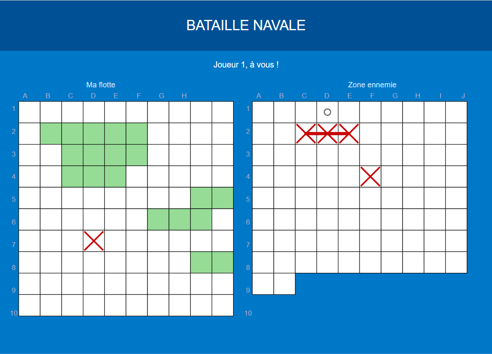

# Bataille Navale — Jeu en Python/Pygame

> 🇫🇷 Français | [🇬🇧 English below](#battleship--python--pygame-game)

---

## Aperçu



---

## Description

Implémentation graphique du jeu de société **Bataille Navale** en Python avec Pygame.  
Le joueur affronte un ordinateur : il place ses bateaux sur sa grille, puis tente de couler la flotte adverse avant que l'IA ne coule la sienne.

## Fonctionnalités

- Interface graphique complète avec Pygame (deux grilles côte à côte)
- Placement interactif des bateaux avec aperçu en temps réel
- Rotation des bateaux avec la touche `R`
- Sous-marin en forme de T (placement spécial)
- IA avec comportement intelligent : tir aléatoire, puis ciblage après un touché
- Affichage des bateaux coulés avec tracé rouge
- Gestion des tours : le joueur rejoue s'il touche, l'IA aussi

## Technologies

- Langage : **Python 3**
- Librairie : **Pygame**

## Installation et lancement

```bash
pip install pygame
python bataille_navale_pygame_fr_v4.py
```

## Contrôles

| Action | Contrôle |
|---|---|
| Placer un bateau | Clic gauche sur la grille |
| Tourner un bateau | Touche `R` |
| Tirer | Clic gauche sur la grille adverse |
| Quitter | Touche `Échap` |

## Bateaux

| Nom | Taille | Forme |
|---|---|---|
| Porte-avion | 5 | Ligne |
| Cuirassé | 4 | Ligne |
| Frégate | 3 | Ligne |
| Sous-marin | 3 | T |
| Torpilleur | 2 | Ligne |

## Projet académique

Projet réalisé en groupe dans le cadre d'un cours d'**Algorithmique avancée**.  

**Mon rôle :** développement du code, logique des grilles, interface graphique Pygame, rédaction du rapport, tests et relecture.

---

# Battleship — Python / Pygame Game

> [🇫🇷 Français ci-dessus](#bataille-navale--jeu-en-pythonpygame) | 🇬🇧 English

---

## Preview


---

## Description

A graphical **Battleship** game built in Python with Pygame.  
The player faces a computer opponent: place your ships, then try to sink the enemy fleet before the AI sinks yours.

## Features

- Full graphical interface with Pygame (two side-by-side grids)
- Interactive ship placement with real-time preview
- Ship rotation with `R` key
- T-shaped submarine (special placement)
- Smart AI: random shots, then targeted hunting after a hit
- Sunken ships displayed with a red line
- Turn management: player replays on hit, AI does too

## Technologies

- Language: **Python 3**
- Library: **Pygame**

## Installation and launch

```bash
pip install pygame
python bataille_navale_pygame_fr_v4.py
```

## Controls

| Action | Control |
|---|---|
| Place a ship | Left click on the grid |
| Rotate a ship | `R` key |
| Fire | Left click on the enemy grid |
| Quit | `Escape` key |

## Ships

| Name | Size | Shape |
|---|---|---|
| Aircraft carrier | 5 | Line |
| Battleship | 4 | Line |
| Frigate | 3 | Line |
| Submarine | 3 | T-shape |
| Torpedo boat | 2 | Line |

## Academic Project

Group project completed as part of an **Advanced Algorithmics** course.  

**My role:** code development, grid logic, Pygame graphical interface, report writing, testing and proofreading.
